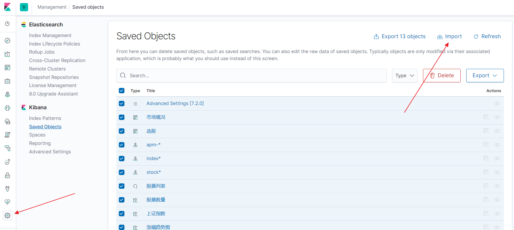
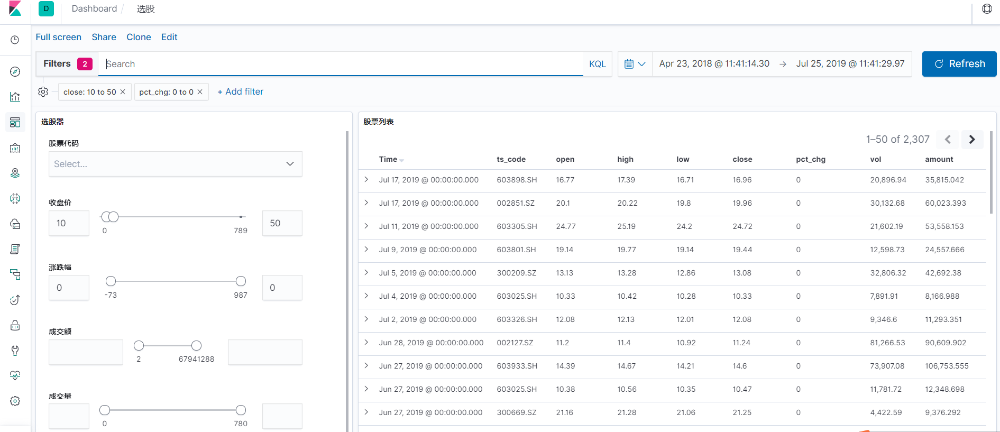
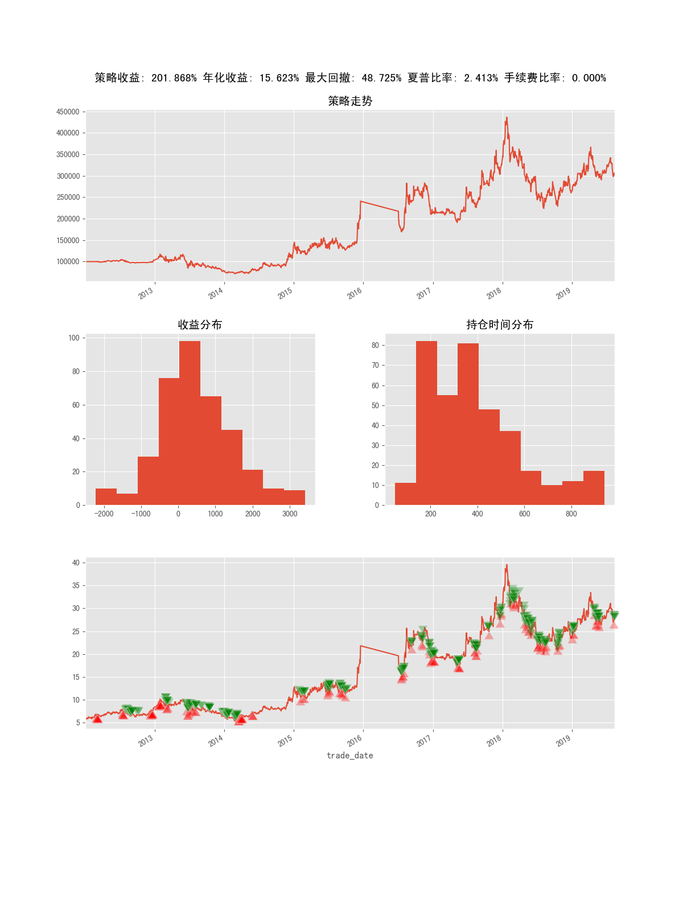

# 股票游乐场
一步一步完善的自己交易系统搭建的代码片段仓库

通往工作时间/地点自由之路.

## 数据篇
### 环境配置
1. Python3(推荐Anaconda安装)
2. 安装依赖 pip install -r requirement.txt
3. 安装nobody python setup.py install
4. 启动elasticsearch, kibana 
```
# 拉取镜像
docker pull sebp/elk:720

# 启动镜像
docker run -p 5601:5601 -p 9200:9200 -p 5044:5044 -v /home/elasticsearch/:/var/lib/elasticsearch -itd  sebp/elk
```

> 

### 配置自己的token
在当前目录下配置一个config.json文件, 内容如下

```
{
    "token": "<your_token>"
}
```

如果可以的话, 可以用我的推荐链接注册吧:) 
> https://tushare.pro/register?reg=277890

### 数据存储
> 话说我的增量更新没有考虑复权，所以使用请谨慎, 可以每次全量更新
保存股票日线行情数据到当前工作目录的data目录，以csv格式存储,下载2012-01-01之后的所有数据
```
python -m nobody save_data
```

### 配置elasticsearch
将settings.py里面的config["es_host"] = ["192.168.56.102:9200"]配置中的ip:port改成你自己的elasticsearch ip地址

### 将数据上传到elasticsearch
```
python -m nobody dump
```

### 配置kibana
配置kibana是需要一定的时间的，好在kibana现在是大多数配置都支持导入导出，所以大家可以通过我仓库的export.ndjson文件直接导入



### 效果展示





参考文章: https://github.com/youerning/blog/tree/master/stock_data

## 回测篇



参考文章: https://github.com/youerning/blog/tree/master/backtest


## 策略篇
## 实战篇
